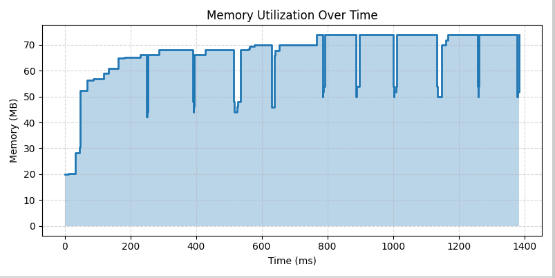

# project
Don't really have a concise name for this yet.
## Steps to download cupti-python
Cupti-python is only available on Linux, and therefore you must be on a linux distribution to run the project. If you're on Windows, then you must run the project on WSL2. You can confirm this by executing `wsl -l -v` in the command prompt. If you have WSL1, execute `wsl --set-version <Distro> 2` to upgrade to WSL2. Replace <Distro> with the distribution you installed WSL with.

WSL2 setup process:

Ensure you have a python version >= python3.9 by doing `python --version`

Create a virtual environment by doing 
```
python -m venv [name_of_your_virtual_environment]
```

Here are the steps in downloading the cuda toolkit 13.0. Follow the instruction to delete the old GPG key on this document and then download the cuda toolkit 13.0: 
https://docs.nvidia.com/cuda/wsl-user-guide/index.html#cuda-support-for-wsl-2 

Ensure that nvidia-smi in the WSL2 terminal has the same/similar output in the Command Prompt by running the command `nvidia-smi` in both terminals. If nvidia-smi outputs an error similar to the one in NOTE 2, then follow those instructions to fix the issue. Then come back and redo the toolkit installation.

The known version that can run the project is pytorch 12.8, thus, we will install pytorch 12.8 and cupti-python 12.8.
Enable your virtual environment and execute this command: 
```
pip3 install torch torchvision --index-url https://download.pytorch.org/whl/cu128 cupti-python==12.8
```

Run the python script if you installed everything correctly in 
```
proto/verify_torch_version.py
```

NOTE 1: You may need to do some tricky things with versioning to get them all to line up with the driver version.

NOTE 2: If `nvidia-smi` outputs `NVIDIA-SMI has failed because it couldn't communicate with the NVIDIA driver. Make sure that the latest NVIDIA driver is installed and running.` then run these commands to delete all old instances of cuda toolkit in WSL2. One of our developers had this issue and this solved it.

1. `sudo apt-get remove --purge '^nvidia-.*'`
2. `sudo apt-get remove --purge '^libnvidia-.*'`
3. `sudo apt-get remove --purge '^cuda-.*'`

Run the sample to see if you've installed CUPTI and torch correctly by following [the tutorial](proto/tutorial.md)

## CUPTI tips
- [Link to python tutorial](https://docs.nvidia.com/cupti-python/13.0.0/user-guide/topics/tutorial.html)

## Steps to using the Profiler API
- Any of the examples in the top level of the `src` dir
- `src/example_matmul.py`
- Running `src/example_matmul_stress.py` should give the output:
- 
